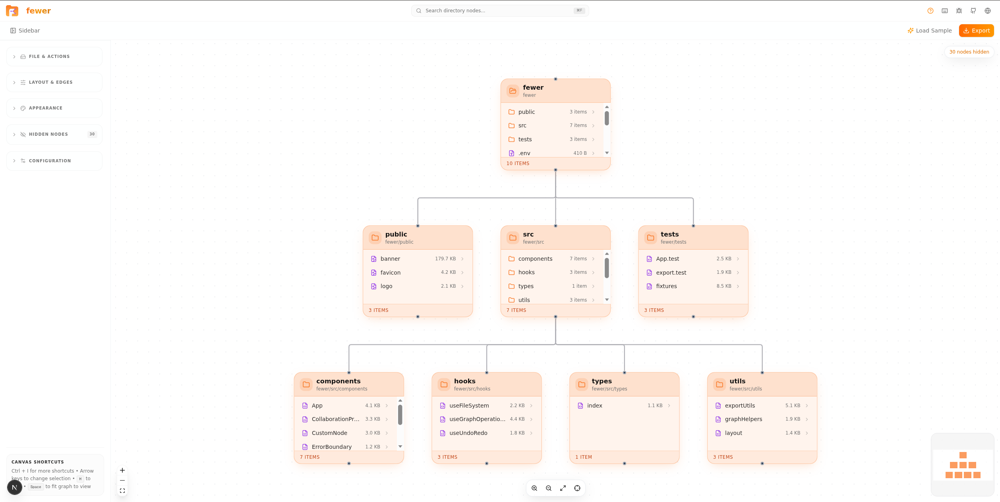

# fewer

### Turn any directory into an interactive graph you can explore, edit, and export.


[Features](#features) • [Install](#install) • [Quick Start](#quick-start) • [How It Works](#how-it-works) • [Keyboard](#keyboard-shortcuts) • [Export](#export) • [Browser Support](#browser-support) • [FAQ](#faq)

---

> [!IMPORTANT]
> **Privacy & Trust** — fewer runs entirely in your browser. No telemetry, no data exfiltration, no config files modified outside the project. The only network call is an optional GitHub repo import. Everything else stays local. To disable instantly: close the tab. To uninstall: delete the repo.

---

## The Problem

You need to understand a directory structure — a new codebase, a project to document, a mess to reorganize. Standard tools don't help: `tree` is static, file managers show one folder at a time, `ls -R` is a wall of text. You scroll, search, switch contexts, and still miss the shape of it.

If you've used a file tree in VS Code or `tree` in the terminal, you know the fix. What's new is turning that tree into an interactive graph — drag, search, edit, rename, export in 7 formats — all in the browser, with nothing to install beyond a dev server.

---

## See It Work

```bash
git clone https://github.com/qvesera/fewer.git
cd fewer
npm install
npm run dev
```

Open `http://localhost:3000`, click **Load sample project**, and explore the graph:



Use arrow keys to navigate the tree. Right-click any node for actions. Press **Ctrl+I** for all shortcuts.

---

## Install

```bash
git clone https://github.com/qvesera/fewer.git
cd fewer
npm install
npm run dev
```

### Prerequisites

- Node.js 18+ (or Bun)
- Chrome/Edge for full File System Access API support; Firefox/Safari via `webkitdirectory` fallback

### Alternative installs

<details>
<summary><b>Bun</b></summary>

```bash
bun install
bun run dev
```

</details>

<details>
<summary><b>Docker</b></summary>

```bash
docker build -t fewer .
docker run -p 3000:3000 fewer
```

</details>

---

## Quick Start

| Step  | Action                                                                      |
| ----- | --------------------------------------------------------------------------- |
| **1** | Click **Load sample project** in the welcome dialog                         |
| **2** | Use **arrow keys** (↑↓←→) to navigate the tree                              |
| **3** | **Right-click** any node for context menu                                   |
| **4** | Press **Ctrl+I** to see all keyboard shortcuts                              |
| **5** | Click **Export** to save the graph (SVG, PNG, JSON, CSV, DOT, script, tree) |

### Import a real directory

1. Click **Import from disk** (or **Alt+I**)
2. Select a folder — configurable depth, hidden files, extension filters
3. The graph builds instantly with Dagre auto-layout

### Edit the graph

- **Rename** a node — **F2** or right-click
- **Add** a node — **Alt+N**
- **Delete** — **Delete** key (cascading children)
- **Copy/Paste** — **Ctrl+C / Ctrl+V** (duplicates with "copy" suffix)
- **Undo/Redo** — **Ctrl+Z / Ctrl+Shift+Z** (50-step history)

---

## Features

<details>
<summary><b>Graph Visualization</b></summary>

- **React Flow v12** canvas with minimap + controls
- **Folder cards** (orange) — children inline, scrollable, item counts, sizes
- **File cards** (purple) — filename, extension, category icon, size
- **4 layout directions**: Top→Bottom, Left→Right, Bottom→Top, Right→Left
- **3 edge styles**: Curved, Angled (adjustable radius), Straight
- **Dagre auto-layout** with type-aware dimensions
- **Breadcrumb bar** — selected node's full path

</details>

<details>
<summary><b>Keyboard Navigation</b></summary>

| Key                       | Action                                 |
| ------------------------- | -------------------------------------- |
| **↑↓←→**                  | Tree navigation (parent/child/sibling) |
| **Alt+N**                 | New node                               |
| **Ctrl+F**                | Search (fuzzy, click-to-zoom)          |
| **Ctrl+E**                | Export panel                           |
| **Ctrl+Z / Ctrl+Shift+Z** | Undo / Redo                            |
| **Ctrl+A**                | Select all                             |
| **Ctrl+L**                | Cycle layout direction                 |
| **Ctrl+I**                | Shortcuts reference                    |
| **F2**                    | Rename                                 |
| **Delete/Backspace**      | Remove (cascading)                     |
| **Space**                 | Fit view                               |
| **+ / - / 0**             | Zoom in/out/reset                      |

</details>

<details>
<summary><b>Search</b></summary>

- **Fuzzy search** across filenames, paths, extensions
- **Click result** → zoom to node
- **Hidden nodes** appear with badge — click to show & zoom
- **Highlight/dim** matched/unmatched nodes

</details>

<details>
<summary><b>Context Menus</b></summary>

| Target     | Actions                                                          |
| ---------- | ---------------------------------------------------------------- |
| **Folder** | Rename, Add Child, Copy Path, Refresh from Disk, Copy, Cut, Hide |
| **File**   | Rename, Open File, Copy Name, Copy, Cut, Delete                  |
| **Canvas** | Fit View, Select All, Zoom In/Out, Show All                      |

</details>

<details>
<summary><b>Import</b></summary>

- **File System Access API** (Chrome/Edge) — real directory read with depth, hidden file, and extension filters
- **Import from File** — JSON export, ASCII tree text, shell/batch `mkdir` scripts
- **Import from URL** — GitHub repo tree (public repos)
- **webkitdirectory** fallback (Firefox/Safari)
- **Brave browser** detection with flag workaround instructions

</details>

<details>
<summary><b>Theming</b></summary>

- **Light / Dark / Custom** modes
- **15 CSS color variables** — separate folder and file colors
- **Live custom theme editor** with hex input + native color swatch
- Changes apply instantly to all nodes

</details>

<details>
<summary><b>File System Integration</b></summary>

- **File operations** — copy, move, delete, create, rename, open files on disk
- **FileSystemHandle** stored on each node for disk-level ops
- **Import settings** — depth limit, hidden files, vendored dirs, extension filter, file/folder toggles

</details>

<details>
<summary><b>Additional</b></summary>

- **Interactive tutorial** — spotlight walkthrough with user interaction
- **Bug report dialog** — structured form with auto-collected diagnostics
- **Error boundary** — crash recovery with retry/reload UI
- **Device detection** — mobile/tablet/desktop with responsive sidebar overlay
- **Stats panel** — file/folder counts, total size, by-category breakdown

</details>

---

## Export

| Format     | Description                                | Use Case                      |
| ---------- | ------------------------------------------ | ----------------------------- |
| **SVG**    | Vector with theme background               | Documentation, presentations  |
| **PNG**    | Raster, adjustable quality, transparent bg | Slides, social media          |
| **JSON**   | Full graph state                           | Re-import, programmatic use   |
| **CSV**    | Tabular nodes + edges                      | Spreadsheets, data analysis   |
| **DOT**    | Graphviz format                            | `dot` rendering pipeline      |
| **Script** | `mkdir -p` shell/batch script              | Reproduce directory structure |
| **Tree**   | Unicode ASCII tree (├── └── │)             | Code comments, READMEs        |

Toggle **Export Selected** to export only the selected subtree.

---

## How It Works

```
User action → KeyboardShortcuts / ContextMenu → graphStore (Zustand) → React Flow re-render
```

The **Zustand store** is the single source of truth. React Flow nodes/edges are derived from store state. **Undo/redo** wraps store actions with a 50-step history buffer.

<details>
<summary><b>Architecture</b></summary>

```
src/
├── app/                      # Next.js App Router
│   ├── layout.tsx            # Root layout + ThemeProvider
│   ├── page.tsx              # Renders <FewerApp />
│   └── api/                  # API routes (GitHub tree, open folder)
├── components/fewer/
│   ├── FewerApp.tsx          # Main shell, orchestrates all dialogs
│   ├── GraphCanvas.tsx       # React Flow canvas + minimap + controls
│   ├── CustomNode.tsx        # Folder/file cards + context menus
│   ├── Sidebar.tsx           # Collapsible sections (File, Layout, Appearance, Stats)
│   ├── Toolbar.tsx           # Top bar with primary actions
│   ├── SearchPanel.tsx       # Fuzzy search with click-to-zoom
│   ├── ExportPanel.tsx       # 7-format export with "selected only" toggle
│   ├── ImportDialog.tsx      # Directory import settings
│   ├── ImportFromFileDialog.tsx  # JSON/ASCII tree/script import
│   ├── ImportUrlDialog.tsx   # GitHub repo import
│   ├── AddNodeDialog.tsx     # New node dialog
│   ├── ShareDialog.tsx       # Share graph as URL
│   ├── BugReportDialog.tsx   # Structured bug report with diagnostics
│   ├── ShortcutsDialog.tsx   # All keyboard shortcuts
│   ├── TutorialDialog.tsx    # Interactive spotlight walkthrough
│   ├── BreadcrumbBar.tsx     # Path breadcrumb navigation
│   ├── CustomThemeEditor.tsx # 15 color pickers
│   ├── ErrorBoundary.tsx     # Crash recovery
│   └── KeyboardShortcuts.tsx # Global hotkey handler
├── lib/fewer/
│   ├── types.ts              # TypeScript types + theme metadata
│   ├── layout.ts             # Dagre layout with type-aware dimensions
│   ├── treeToGraph.ts        # Tree → flat nodes/edges
│   ├── fileSystem.ts         # File System Access API
│   ├── fileOps.ts            # Copy/move/delete/create/open on disk
│   ├── importOptions.ts      # Import configuration
│   ├── parsers.ts            # JSON/ASCII tree/script parsers
│   ├── exportUtils.ts        # SVG/PNG/JSON/CSV/DOT exporters
│   ├── scriptExport.ts       # Shell/batch + ASCII tree generators
│   ├── validation.ts         # Connection validation + ancestor/descendant utils
│   ├── navigation.ts         # Arrow key tree navigation
│   ├── categorize.ts         # Extension → category mapping
│   ├── share.ts              # URL sharing
│   ├── errors.ts             # Type-safe error system
│   └── stats.ts              # Stats computation + fuzzy match
├── store/graphStore.ts       # Zustand store (nodes, edges, history, theme, clipboard)
└── hooks/
    ├── use-device.ts         # Mobile/tablet/touch/reduced-motion detection
    ├── use-mobile.ts         # Mobile breakpoint hook
    ├── use-github-import.ts  # GitHub import hook
    └── use-toast.ts          # Toast notifications
```

</details>

---

## Tech Stack

| Layer     | Technology                                     |
| --------- | ---------------------------------------------- |
| Framework | Next.js 16 (App Router, Turbopack)             |
| UI        | React 19, Tailwind CSS 4, shadcn/ui (New York) |
| Graph     | React Flow v12 (@xyflow/react), Dagre          |
| State     | Zustand                                        |
| Language  | TypeScript 5 (strict)                          |
| Database  | Prisma ORM + SQLite                            |
| Icons     | Lucide React                                   |
| Fonts     | Geist Sans / Geist Mono                        |

---

## Browser Support

| Feature                            | Chrome/Edge | Firefox | Safari |
| ---------------------------------- | :---------: | :-----: | :----: |
| Graph visualization                |     ✅      |   ✅    |   ✅   |
| Import directory (FS Access API)   |     ✅      |   ❌    |   ❌   |
| Import directory (webkitdirectory) |     ✅      |   ✅    |   ✅   |
| Open files from disk               |     ✅      |   ❌    |   ❌   |
| Export (all formats)               |     ✅      |   ✅    |   ✅   |
| Keyboard shortcuts                 |     ✅      |   ✅    |   ✅   |
| Custom theme                       |     ✅      |   ✅    |   ✅   |

---

## FAQ

**Q: Does fewer send my directory data anywhere?**
A: No. Everything runs in your browser. The only network call is an optional GitHub import (public repos only). No telemetry, no analytics.

**Q: Can I use fewer without installing anything?**
A: Yes — the standalone version is available at [fewer.directory](https://fewer.directory). The self-hosted version requires `npm install && npm run dev`.

**Q: Why does directory import not work in Firefox/Safari?**
A: File System Access API is Chrome/Edge-only. Firefox and Safari use the `webkitdirectory` fallback — works for import, but can't write back to disk.

**Q: How do I uninstall?**
A: Delete the repo folder. That's it — no background processes, no config files, no registry entries.

---

## Roadmap

See [ROADMAP.md](ROADMAP.md) for the full roadmap — short-term, medium-term, and long-term plans.

---

## Contributing

See [CONTRIBUTING.md](CONTRIBUTING.md) for guidelines. By participating, you agree to abide by the [Code of Conduct](CODE_OF_CONDUCT.md).

## License

AGPLv3 — see [LICENSE](LICENSE) for details.

## Acknowledgments

- [React Flow](https://reactflow.dev/) — graph visualization library
- [Dagre](https://github.com/dagrejs/dagre) — directed graph layout algorithms
- [shadcn/ui](https://ui.shadcn.com/) — accessible component library
- [Tailwind CSS](https://tailwindcss.com/) — utility-first CSS framework
- [Lucide](https://lucide.dev/) — icon set
- [Directory icons by Freepik - Flaticon](https://www.flaticon.com/free-icons/directory)
